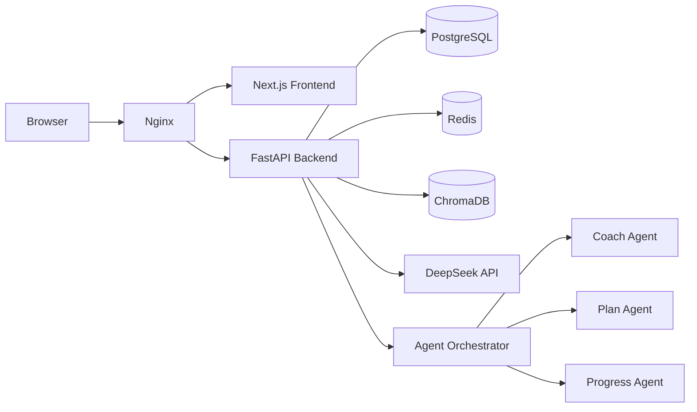

# FitPilot 🏋️‍

### 从“我想健身”到“今天练什么”的 AI 训练执行系统

> 面向健身新手的 AI 训练规划与追踪平台：将用户目标、训练经验、可用器械与时间约束，转化为**可校验、可执行、可追踪**的结构化训练计划。

<p align="center">
  
</p>

<p align="center">
  <a href="YOUR_30S_VIDEO_URL"><strong>🎥 30 秒演示</strong></a>
  ·
  <a href="#-技术架构与-ai-策略"><strong>🧠 技术架构</strong></a>
</p>

<p align="center">
  
  
  
  
  
  
</p>

|       3 个专业 Agent       |        9 类健身意图        |   17 条计划校验规则  | 174+ 自动化测试 |
| :---------------------: | :-------------------: | :-----------: | :--------: |
| Coach / Plan / Progress | 规则 + Pattern + LLM 融合 | 结构、器械、动作与安全约束 | 后端、前端与集成测试 |

---

## 目录

* [一句话项目简介](#-一句话项目简介)
* [解决了谁的问题](#-解决了谁的问题)
* [核心功能](#-核心功能)
* [技术架构与 AI 策略](#-技术架构与-ai-策略)
* [用户反馈](#-用户反馈)
* [Demo 与演示视频](#-demo-与演示视频)

---

## 🎯 一句话项目简介

FitPilot 不是只会输出训练建议的聊天机器人，而是一套完整的 AI 健身业务系统：

```text
健身档案
→ AI 生成结构化训练计划
→ 规则校验与持久化
→ 训练组记录与状态流转
→ 训练趋势分析
→ AI 周报与安全问答
```

系统覆盖从“制定计划”到“完成训练并复盘”的完整闭环。

---

## 👤 解决了谁的问题

### 健身新手

很多用户知道自己想增肌或减脂，但不知道：

* 一周练几次、每次练什么；
* 每个动作做多少组、多少次、使用多大强度；
* 家里只有哑铃或徒手条件时如何替换动作；
* 训练完成后如何判断自己是否真的进步。

### 使用普通 AI 助手的用户

通用大模型可以生成建议，但经常存在：

* 动作名称或器械不符合用户条件；
* 输出是一段文本，无法直接执行和记录；
* 计划结构不稳定，缺乏业务规则校验；
* 对疼痛、伤病等问题缺乏明确的安全边界。

### FitPilot 的解决方式

FitPilot 将 AI 输出限制在真实动作库中，并通过 JSON Schema、Pydantic 和业务规则校验，把自然语言建议转换成可执行的训练数据。

---

## ✨ 核心功能

### 1. AI 结构化训练计划生成

用户填写目标、经验、训练频率和器械后，系统自动生成包含训练日、动作、组数、次数、RPE 和休息时间的完整计划。

<p align="center">
  
</p>

```text
Fitness Profile
→ 候选动作筛选
→ DeepSeek 生成 JSON
→ Pydantic 结构校验
→ 17 条业务规则校验
→ PostgreSQL 事务保存
```

**工程亮点**

* 模型只能从候选动作白名单中选择动作；
* 自动检查器械、训练频率、动作数量、RPE 和次数范围；
* 模型输出不合格时，将校验错误反馈给模型重试；
* 计划、训练日和动作在同一数据库事务中保存。

---

### 2. 训练执行与数据追踪

用户可以激活计划、开始训练、记录每一组的重量、次数和 RPE，并完成或跳过动作。

<p align="center">
  
</p>

系统通过状态机保证训练流程一致：

```text
Workout Session
in_progress → completed / cancelled

Workout Exercise
pending → in_progress → completed / skipped
```

训练结束后自动计算：

* 完成训练次数；
* 完成组数与总次数；
* 训练容量；
* 训练时长；
* 连续训练天数。

---

### 3. 训练分析、AI 周报与安全教练

<p align="center">
  
</p>

FitPilot 将训练记录聚合为可解释的进度指标，并生成周期总结：

* 28 天训练概览；
* 每周训练趋势；
* 单动作表现变化；
* 肌群训练分布；
* AI 周报与规则降级报告；
* 基于知识库的健身问答；
* 疼痛和伤病场景的安全提示。

当模型服务不可用时，Weekly Report 会自动降级为规则报告，避免核心业务完全依赖 LLM。

---

## 🧠 技术架构与 AI 策略

### 系统架构



### 技术栈

| 模块    | 技术                                                       |
| ----- | -------------------------------------------------------- |
| 前端    | Next.js、TypeScript、Tailwind CSS、shadcn/ui、TanStack Query |
| 后端    | FastAPI、Pydantic、SQLAlchemy Async、Alembic                |
| 模型    | DeepSeek V4 Flash，兼容 Anthropic Messages API              |
| Agent | Coach Agent、Plan Agent、Progress Agent                    |
| 数据库   | PostgreSQL、Redis、ChromaDB                                |
| 可观测性  | Prometheus、结构化日志、Agent 执行统计                              |
| 部署    | Docker Compose、Nginx、数据库自动迁移与 Seed                       |
| 测试    | Pytest、Vitest、API Smoke Test、LLM-as-Judge                |

### Prompt 与可靠性策略

#### 1. Profile-aware Prompt

Prompt 中注入用户的：

* 训练目标；
* 经验等级；
* 每周训练频率；
* 可用器械；
* 身体限制；
* 候选动作列表。

#### 2. Structured Output

模型必须按照指定 JSON Schema 返回计划，不接收自由格式 Markdown 作为最终结果。

#### 3. 双层校验

```text
Pydantic 结构校验
+
业务规则校验
```

校验内容包括动作是否存在、器械是否可用、训练日数量、动作数量、组数、次数、RPE 和休息时间。

#### 4. 安全优先路由

当输入命中疼痛、刺痛、骨折、手术等安全关键词时：

* 强制路由至 Coach Agent；
* 禁止进入多 Agent 协作；
* 自动附加安全提示；
* 标记需要专业人员介入。

#### 5. RAG 与降级机制

健身知识通过 ChromaDB 检索注入回答。查询改写或知识库检索失败时，系统降级使用原始问题，不中断聊天主链路。

#### 6. 统一 LLM Client

统一处理：

* Thinking Block 与 Text Block；
* 空响应；
* Token 截断；
* JSON 解析；
* 429、5xx 和超时重试；
* 401、402、403 非重试错误；
* 上游错误脱敏。

---

## 💬 用户反馈

暂未部署上线，敬请期待！

## 🚀 演示视频

### 30 秒演示内容
【FitPilot_demo】 https://www.bilibili.com/video/BV1DMjw6YEQu/?share_source=copy_web&vd_source=e8d92d8531f65156cd36ffaa0a32448b

### 本地运行

```bash
git clone https://github.com/GSQingnb/FitPilot.git
cd FitPilot

cp .env.example .env
# 配置 PostgreSQL、JWT 与模型 API Key

docker compose up -d --build
```

访问：

```text
http://localhost
```

---

## License

This project is intended for learning, portfolio demonstration, and non-commercial research use.
