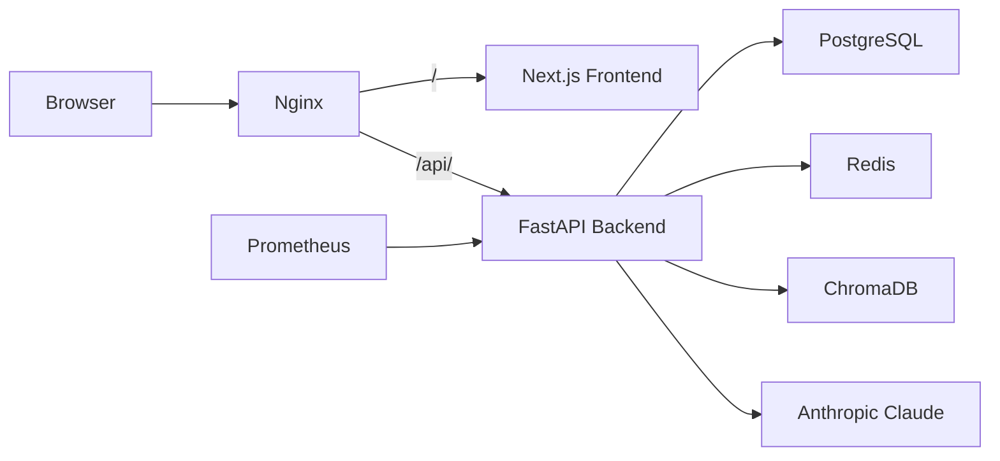
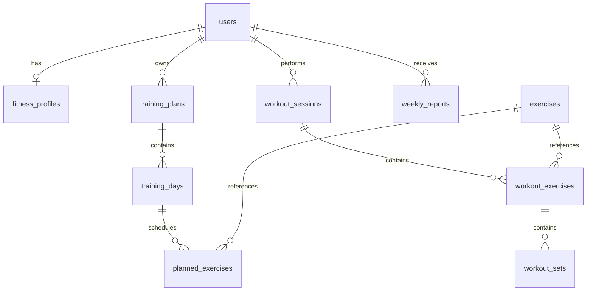

# FitPilot — AI-Powered Fitness Planning & Workout Tracking

FitPilot is a full-stack AI fitness platform that generates personalized training plans, tracks every set and rep, provides analytics and weekly reports, and offers an AI coach for real-time guidance — all deployable with a single Docker command.

**Status**: MVP — fully functional local deployment with AI-assisted features.

## Screenshots

<!-- TODO: add real screenshots -->

| Dashboard | Training Plan | Current Workout |
|-----------|---------------|-----------------|
|  |  |  |

| Analytics | Weekly Report | AI Coach |
|-----------|---------------|----------|
|  |  |  |

> Note: Screenshots are placeholder paths. To generate them, run the app and capture each page.

## Core Features

- **Authentication** — Register and login with JWT access tokens and HttpOnly refresh cookies
- **Fitness Profile** — Set goals, experience level, equipment, and training frequency
- **AI Training Plans** — Generate structured plans tailored to your profile (LLM-powered)
- **Plan Lifecycle** — Activate, view details, and archive plans
- **Workout Execution** — Start workouts from active plans, record sets with weight/reps/RPE
- **Workout History** — Browse completed sessions with full exercise and set details
- **Training Analytics** — Overview stats, weekly trends, exercise progression, muscle distribution
- **Weekly Reports** — AI-generated summaries with highlights, issues, and recommendations
- **AI Coach** — Chat with a domain-aware fitness assistant
- **Data Isolation** — All user data is ownership-checked at the API layer
- **One-Cmd Deploy** — `docker compose up -d --build` brings up the entire stack

## Architecture



**Data stores**: PostgreSQL (business data), Redis (refresh tokens / locks / sessions), ChromaDB (knowledge base RAG), Prometheus (monitoring).

**Agent workflow**: User message → Intent Recognition (LLM + Embedding + Pattern) → Agent Router → CoachAgent / PlanAgent / ProgressAgent → Safety Layer → Response.

## Agent System

FitPilot uses a multi-agent architecture with nine intent categories and three specialized agents:

| Agent | Responsibilities |
|-------|-----------------|
| **CoachAgent** | General fitness knowledge, exercise guidance, safety boundaries |
| **PlanAgent** | Training plan generation and adjustment |
| **ProgressAgent** | Performance analysis, plateau detection, recovery advice |

**Intent categories**: `general_question`, `exercise_query`, `plan_generation`, `plan_adjustment`, `progress_review`, `safety_concern`, `greeting`, `feedback`, `other`.

The routing engine uses a three-layer strategy: intent mapping → performance-based selection → fallback. Safety concerns get priority routing with automatic disclaimer injection.

## Technology Stack

| Layer | Technologies |
|-------|-------------|
| **Frontend** | Next.js 16, React 19, TypeScript, Tailwind CSS, shadcn/ui, TanStack Query, Recharts |
| **Backend** | Python 3.12, FastAPI, SQLAlchemy 2.x (async), Pydantic v2, Alembic |
| **AI/ML** | Anthropic Claude (configurable), ChromaDB embeddings |
| **Data** | PostgreSQL 16, Redis 7, ChromaDB 0.5 |
| **Infra** | Docker Compose, Nginx, Prometheus |
| **Testing** | pytest, Vitest, Python smoke test |

## Quick Start

### Prerequisites

- Docker and Docker Compose
- An Anthropic API key (for AI features)

### Setup

```bash
# Clone the repository
git clone <repo-url>
cd FitPilot

# Create your environment file
cp .env.example .env
# Edit .env and set:
#   ANTHROPIC_API_KEY=your_key_here
#   JWT_SECRET_KEY=a_strong_random_secret
#   POSTGRES_PASSWORD=a_db_password

# Start all services
docker compose up -d --build
```

On Windows PowerShell:

```powershell
Copy-Item .env.example .env
# Edit .env with your values
docker compose up -d --build
```

### Access

| Service | URL |
|---------|-----|
| **Application** | http://localhost |
| **API Docs (Swagger)** | http://localhost/api/docs |
| **Prometheus** | http://localhost:9090 |

> AI features (plan generation, AI coach, weekly reports) require a valid `ANTHROPIC_API_KEY`. Without it, the rule-based fallback generates basic reports.

## Environment Variables

See `.env.example` for all options. Key variables:

| Variable | Purpose |
|----------|---------|
| `ANTHROPIC_API_KEY` | Anthropic API key for AI features |
| `JWT_SECRET_KEY` | Secret for signing JWT tokens (must be strong) |
| `POSTGRES_DB` / `POSTGRES_USER` / `POSTGRES_PASSWORD` | Database credentials |
| `AUTH_COOKIE_PATH` | Refresh cookie path (`/api/auth` in Docker, `/auth` in dev) |
| `AUTH_COOKIE_SECURE` | Set to `true` for HTTPS (production) |
| `FRONTEND_ORIGINS` | Comma-separated allowed CORS origins |

## Database Model



**Key design**: `planned_exercises` (what you should do) and `workout_sessions`/`workout_exercises`/`workout_sets` (what you actually did) are separate — plans can evolve while history remains immutable.

## API Overview

| Module | Endpoints | Auth Required |
|--------|-----------|---------------|
| **Auth** | `/api/auth/register`, `/api/auth/login`, `/api/auth/me`, `/api/auth/refresh`, `/api/auth/logout` | Mixed |
| **Users** | `/api/users/{id}`, `/api/users/{id}/fitness-profile` | Yes |
| **Exercises** | `/api/exercises`, `/api/exercises/{id}` | No |
| **Training Plans** | `/api/users/{id}/training-plans`, `/api/training-plans/{id}` | Yes |
| **Workouts** | `/api/users/{id}/workouts`, `/api/workouts/{sid}/...` | Yes |
| **Analytics** | `/api/users/{id}/analytics/overview`, `.../weekly`, `.../exercises/{eid}`, `.../muscles` | Yes |
| **Reports** | `/api/users/{id}/weekly-reports` | Yes |
| **Chat** | `/api/chat` | Yes |

Full interactive docs: http://localhost/api/docs

## Testing

```bash
# Backend unit tests
python -m pytest -q

# Frontend pipeline
cd frontend
pnpm lint
pnpm typecheck
pnpm test
pnpm build
cd ..

# End-to-end smoke test (requires running services)
python scripts/smoke_test.py
```

## Project Structure

```
FitPilot/
├── api/                  # FastAPI routes, dependencies, schemas
├── agents/               # CoachAgent, PlanAgent, ProgressAgent, orchestrator
├── core/                 # Intent recognizer, JWT security
├── services/             # Business logic: auth, plans, workouts, analytics, reports
├── database/             # SQLAlchemy models, repositories, Alembic migrations
├── memory/               # Redis + ChromaDB conversation memory
├── monitor/              # Performance monitoring
├── evaluation/           # LLM-as-Judge evaluation framework
├── mcp/                  # MCP tool manager, knowledge base
├── frontend/             # Next.js app
│   ├── app/              # Page routes (dashboard, plans, workouts, etc.)
│   ├── components/       # UI components, auth, layout
│   ├── lib/api/          # API client with token management
│   └── tests/            # Vitest tests
├── config/               # Nginx, Prometheus configs
├── scripts/              # Smoke test
├── docker-compose.yml    # Service orchestration
├── Dockerfile            # Backend image
└── requirements.txt      # Python dependencies
```

## Security Design

- **Password hashing**: PBKDF2-SHA256 with 600,000 iterations
- **Access tokens**: JWT (HS256), 15-minute expiry
- **Refresh tokens**: JWT + Redis blacklist, 7-day expiry, HttpOnly cookie
- **Refresh rotation**: Old tokens invalidated on use; replay detection triggers family revocation
- **Ownership checks**: Every user-owned resource validated against authenticated user
- **Secrets**: Never committed; `.env` in `.gitignore`
- **Current status**: MVP — not production-hardened. No TLS, email verification, or OAuth.

## Known Limitations

- Requires a valid Anthropic API key for AI features
- No email verification
- No password recovery flow
- No OAuth / social login
- No MFA
- No async task queue (Celery)
- No production TLS configuration
- Docker build may be slow on unstable networks

## Roadmap

- Email verification and password recovery
- Background job processing (Celery)
- Mobile client
- Advanced exercise analytics (1RM estimation, volume progression)
- Production deployment guide (TLS, cloud volumes, monitoring alerts)

## License

MIT
