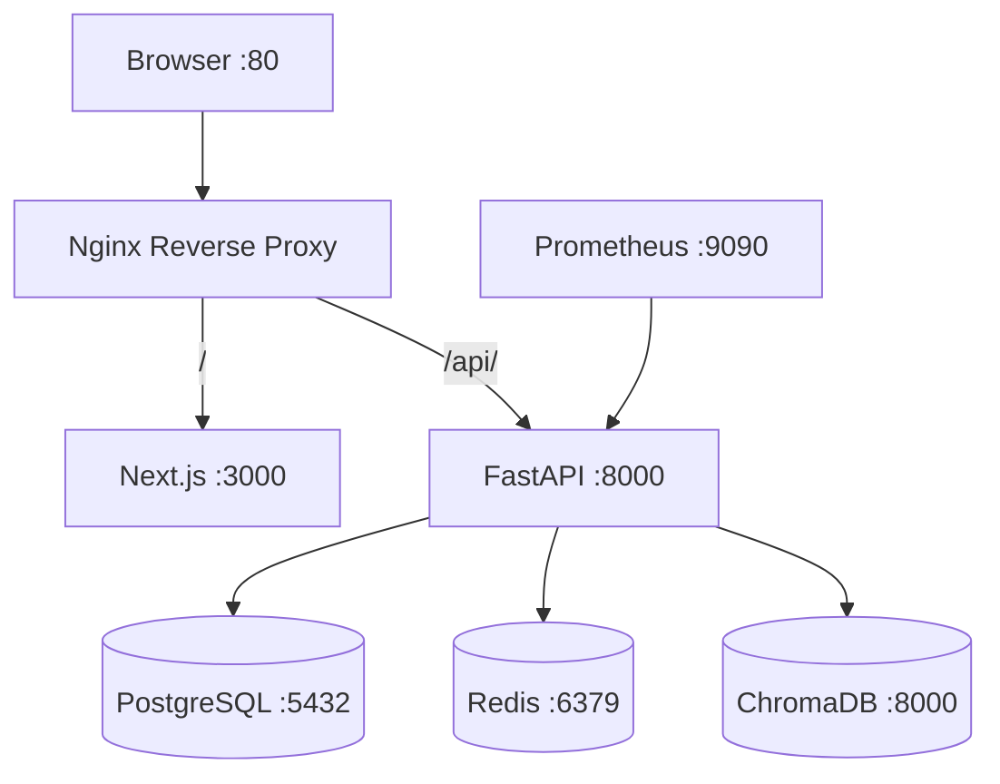
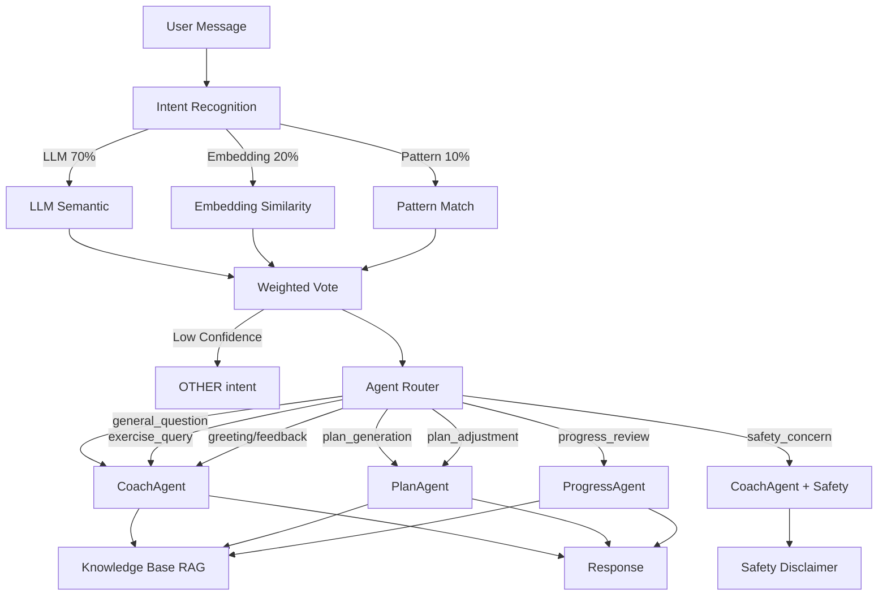
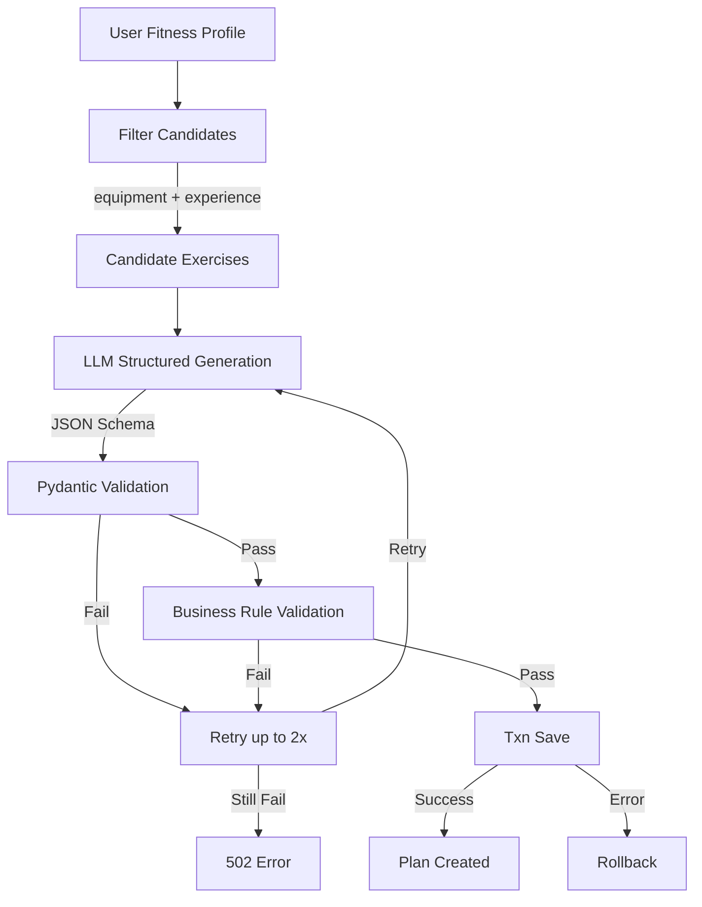
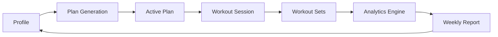

# FitPilot System Architecture

## Deployment Architecture

**Nginx** is the single entry point. The `/api/` prefix is stripped before forwarding to FastAPI, enabling same-origin deployment without CORS issues. The frontend is built with `NEXT_PUBLIC_API_BASE_URL=/api` so all browser API calls go to the same host.

**FastAPI** handles all business logic. It uses async SQLAlchemy for PostgreSQL, Redis for token storage and rate limiting, and ChromaDB for the fitness knowledge base (RAG).

**PostgreSQL** stores all business data: users, profiles, exercises, training plans, workout records, and reports.

**Redis** stores refresh token blacklist entries, generation locks, login attempt counters, and conversational working memory.

**ChromaDB** stores the fitness knowledge base (exercise guides, training principles) for semantic search via the `/api/search` endpoint.

## Agent Workflow

The three-way intent fusion (LLM 70%, Embedding 20%, Pattern 10%) runs LLM and embedding in parallel, then weighted-votes to select the final intent. Low-confidence results degrade to `OTHER`.

The safety layer activates when `safety_concern` is detected or keywords (pain, injury, medical terms) are matched. It prepends a safety disclaimer before the agent's response.

## Training Plan Generation Flow

Key constraints:
- Only exercises matching the user's equipment and experience are candidates
- The LLM must output `exercise_id` from the candidate list — no invented exercises
- Business rules validate set counts, rep ranges, RPE, and training day structure
- Everything saves in a single transaction — partial plans are never persisted

## Core Business Data Flow

1. User sets up their fitness profile (goals, equipment, experience)
2. AI generates a structured training plan from filtered exercises
3. User activates the plan
4. Workout sessions copy planned exercises as workout exercises
5. User records sets with weight, reps, and RPE
6. Analytics aggregates completed sessions and sets via SQL
7. Weekly reports snapshot analytics + LLM summary into persistent records
