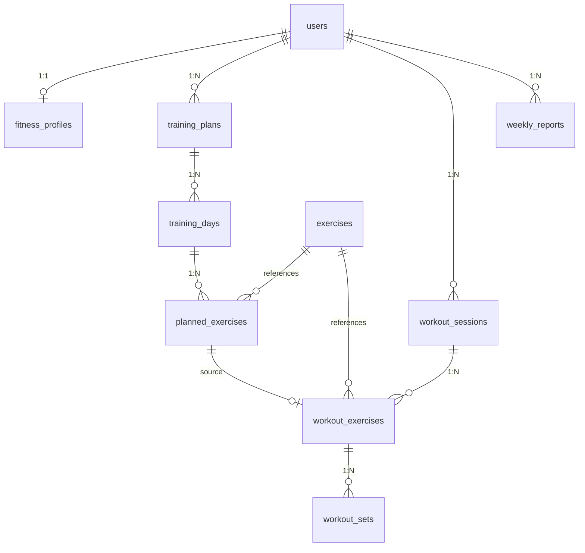

# FitPilot Database Design

## Overview

FitPilot uses PostgreSQL 16 with SQLAlchemy 2.x async ORM and Alembic migrations. All tables use UUID primary keys and UTC timestamps.

## Entity-Relationship Diagram

## Tables

### users

Stores user accounts. `password_hash` is PBKDF2-SHA256 hashed. `email` is normalized (lowercase, trimmed) and unique.

| Column | Type | Notes |
|--------|------|-------|
| id | UUID PK | |
| email | VARCHAR(320) UNIQUE | Normalized |
| display_name | VARCHAR(100) | |
| is_active | BOOLEAN | Default true |
| password_hash | TEXT NULL | PBKDF2 |
| last_login_at | TIMESTAMPTZ NULL | |

### fitness_profiles

One profile per user. Stores training preferences used by the plan generator.

| Column | Type | Notes |
|--------|------|-------|
| user_id | UUID FK UNIQUE | CASCADE on delete |
| goal | ENUM | muscle_gain, fat_loss, strength, general_fitness |
| experience_level | ENUM | beginner, intermediate, advanced |
| weekly_frequency | INTEGER | 1-7 |
| session_duration_minutes | INTEGER | 15-240 |
| available_equipment | JSONB | List of equipment strings |
| target_muscles | JSONB | List of muscle group strings |
| excluded_exercises | JSONB | Exercise IDs or names to skip |
| limitations | TEXT NULL | Free-text notes |

### exercises

Standard exercise library. Seeded with 20 exercises covering all major movement patterns.

| Column | Type | Notes |
|--------|------|-------|
| name | VARCHAR(200) UNIQUE | |
| primary_muscle | VARCHAR(100) | Indexed |
| equipment | ENUM | bodyweight, dumbbell, barbell, machine, cable, kettlebell, resistance_band, other |
| difficulty | ENUM | beginner, intermediate, advanced |
| movement_pattern | VARCHAR(100) | squat, hinge, push_horizontal, push_vertical, pull_horizontal, pull_vertical, isolation |
| is_active | BOOLEAN | Soft-delete via false |

### training_plans

AI-generated or manual training programs. Each user can have multiple plans.

| Column | Type | Notes |
|--------|------|-------|
| user_id | UUID FK | CASCADE on delete |
| name | VARCHAR(200) | |
| goal | VARCHAR(100) | |
| duration_weeks | INTEGER | |
| weekly_frequency | INTEGER | |
| status | ENUM | draft, active, archived |
| version | INTEGER | Auto-incrementing per user |
| source | ENUM | manual, ai_generated |

### training_days

Each plan has N days (one per weekly_frequency).

| Column | Type | Notes |
|--------|------|-------|
| training_plan_id | UUID FK | CASCADE |
| day_index | INTEGER | UNIQUE per plan |
| title | VARCHAR(200) | |

### planned_exercises

What the plan says you should do.

| Column | Type | Notes |
|--------|------|-------|
| training_day_id | UUID FK | CASCADE |
| exercise_id | UUID FK | RESTRICT (don't delete referenced exercises) |
| order_index | INTEGER | UNIQUE per day |
| sets | INTEGER | |
| reps_min | INTEGER | |
| reps_max | INTEGER | |
| rest_seconds | INTEGER | |
| target_rpe | FLOAT NULL | |

### workout_sessions

One session = one actual training event.

| Column | Type | Notes |
|--------|------|-------|
| user_id | UUID FK | CASCADE |
| training_plan_id | UUID FK NULL | SET NULL on plan delete |
| training_day_id | UUID FK NULL | SET NULL |
| status | ENUM | in_progress, completed, cancelled |
| started_at | TIMESTAMPTZ | |
| completed_at | TIMESTAMPTZ NULL | |
| duration_seconds | INTEGER NULL | Calculated on complete |
| perceived_difficulty | FLOAT NULL | 1-10 |

### workout_exercises

What you actually did for one exercise in a session. Created by copying planned_exercises on workout start.

| Column | Type | Notes |
|--------|------|-------|
| workout_session_id | UUID FK | CASCADE |
| exercise_id | UUID FK | RESTRICT |
| planned_exercise_id | UUID FK NULL | Source reference, SET NULL |
| order_index | INTEGER | UNIQUE per session |
| status | ENUM | pending, in_progress, completed, skipped |

### workout_sets

Individual sets with actual weight, reps, and RPE.

| Column | Type | Notes |
|--------|------|-------|
| workout_exercise_id | UUID FK | CASCADE |
| set_index | INTEGER | UNIQUE per exercise |
| set_type | ENUM | warmup, working, drop, failure, timed, bodyweight |
| weight_kg | FLOAT NULL | |
| reps | INTEGER NULL | |
| duration_seconds | INTEGER NULL | For timed sets |
| distance_meters | FLOAT NULL | For cardio |
| rpe | FLOAT NULL | 1-10 |
| is_completed | BOOLEAN | Default true |

### weekly_reports

AI or rule-based training summaries. `metrics` JSONB stores a snapshot of analytics at generation time so reports remain immutable even as more workout data accumulates.

| Column | Type | Notes |
|--------|------|-------|
| user_id | UUID FK | CASCADE |
| period_start | DATE | |
| period_end | DATE | UNIQUE(user_id, period_start, period_end) |
| status | ENUM | generated, failed |
| source | ENUM | ai, rule_based |
| metrics | JSONB | Snapshot of analytics |
| summary | TEXT | |
| highlights | JSONB | String array |
| issues | JSONB | String array |
| recommendations | JSONB | String array |
| model_name | VARCHAR NULL | LLM model used |

## Key Design Decisions

### Plan vs Actual Separation

`planned_exercises` (the plan) and `workout_sessions`/`workout_exercises`/`workout_sets` (what actually happened) are stored in separate tables. Training plans can be modified or archived without affecting historical workout data.

### Cascading Deletes

- User deletion cascades to all owned data
- Training plan deletion cascades to training days and planned exercises
- Workout exercise deletion cascades to sets
- Exercise deletion is RESTRICTED — use `is_active=false` instead

### Analytics as SQL

All analytics and trend calculations are performed via PostgreSQL aggregate queries on completed workout data. The `weekly_reports.metrics` field snapshots these calculations so reports remain accurate even as the underlying data changes.
